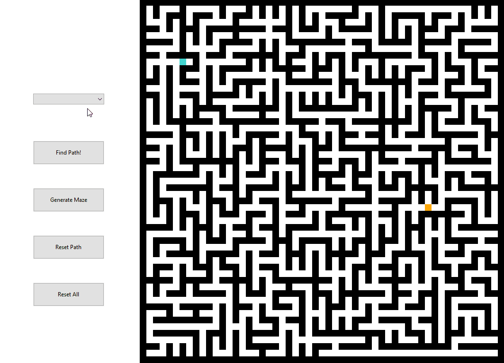

# PathFinding
An application to visualise shortest path finding algorithms.

## How to run
First, download and compile the code using your preferred C++ compiler.
The GUI is written using the [wxWidgets](https://www.wxwidgets.org/) library so that will need to be installed ([guide here](https://wiki.wxwidgets.org/Install)).

## How to use
### Creating the map
&nbsp;&nbsp;&nbsp;&nbsp;In order to find the shortest path, a map must be created. To do this, left click anywhere in the grid to place a node. If there is no start node placed (the blue node), that will be placed first. Similarly, if there is no end node placed (the orange node), that will be placed first. Once there is a start and end node, barriers (black nodes) will be placed.
To remove a node, right click on it.
Clicking and dragging will add a node to each position passed over.
Clicking on the "Reset Path" button will remove the path and all working from the grid but leave the rest of the nodes.
Clicking on the "Reset All" button will reset the whole path.

### Generating a maze
&nbsp;&nbsp;&nbsp;&nbsp;To generate a maze click on the generate maze button. You can then place a start and end node anywhere in the maze, and add/remove barriers like normal.

### Finding the path
&nbsp;&nbsp;&nbsp;&nbsp;To find the shortest path between the start and end node, first select an algorithm from the dropdown menu, then click the "Find Path!" button to begin the algorithm. Clicking the button a second time will reset the path and begin the select begin the algorithm again.

